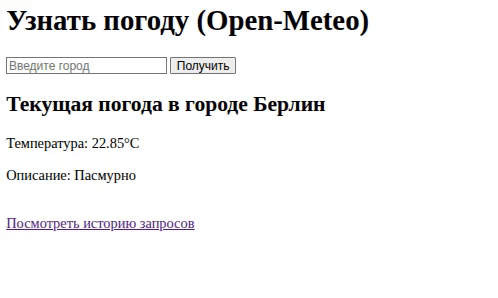

# Простое погодное веб-приложение

Это простое веб-приложение, созданное в рамках тестового задания. Оно позволяет пользователям вводить название города, получать текущую погоду с помощью API Open-Meteo и просматривать историю запросов.

Весь проект обернут в Docker для легкого и быстрого развертывания.




---

## 🚀 Основные возможности

*   **Получение погоды:** Введите название города и узнайте текущую температуру и погодные условия.
*   **Интеграция с API:** Использует Geocoding и Forecast API от [Open-Meteo](https://open-meteo.com/) для получения точных данных.
*   **История запросов:** Каждый успешный запрос сохраняется в базу данных PostgreSQL.
*   **Просмотр истории:** Отдельная страница для отображения всех предыдущих запросов с указанием времени.
*   **Docker-конфигурация:** Полностью готово к запуску с помощью Docker, что исключает проблемы с зависимостями.

---

## 🛠️ Технологический стек

*   **Язык:** `🐍 Python 3.9`
*   **Веб-фреймворк:** `🚀 Django 4.x`
*   **База данных:** `🐘 PostgreSQL`
*   **Оркестрация:** `🐳 Docker & Docker Compose`
*   **Библиотеки:** `requests`, `pandas`, `openmeteo-requests`

---

## ⚙️ Установка и запуск

Для запуска проекта на вашем компьютере вам понадобятся **Docker** и **Docker Compose**.

#### Шаг 1: Клонирование репозитория

```bash
git clone https://github.com/YOTTSO/weather-app.git
cd weather-app
```

#### Шаг 2: Сборка и запуск контейнеров

Эта команда соберет образ вашего Django-приложения и запустит контейнеры для веб-сервера и базы данных в фоновом режиме.

```bash
docker-compose up --build -d
```

#### Шаг 3: Применение миграций базы данных

После первого запуска контейнеров необходимо создать таблицы в базе данных на основе моделей Django.

```bash
docker-compose exec web python manage.py makemigrations -- создаёт файл миграций базы данных

docker-compose exec web python manage.py migrate -- применение миграций 
```

#### Шаг 4: Запуск

Приложение готово к работе! Откройте браузер и перейдите по адресу:

**[http://127.0.0.1:8000/](http://127.0.0.1:8000/)** или **[http://0.0.0.0:8000/](http://0.0.0.0:8000/)** или **[http://localhost:8000/](http://localhost:8000/)**

---

## 📖 Как пользоваться

1.  На главной странице введите название города (например, "Москва" или "Берлин") в поле ввода.
2.  Нажмите кнопку "Получить".
3.  Под формой отобразятся текущая температура и описание погоды.
4.  Для просмотра всех предыдущих запросов перейдите по ссылке "Посмотреть историю запросов" или напрямую по адресу `http://127.0.0.1:8000/history/` или `http://0.0.0.0:8000/history` или `http://localhost:8000/`.